# Austin Animal Shelter Outcomes Prediction

## Introduction

Project set out to create a categorical prediction model to accurately predict the outcome of
animals taken into animal shelters in Austin, Texas using the Austin Animal Centre data set. The hope is that better prediction of outcomes can assist decisions related to animal welfare and financial considerations of the charity.

The project was end-to-end and involved data collection, data wrangling, EDA, model testing and evaluation. 

The data set contains approximately 100,000 records and was stored in a Hadoop distributed file system and processed using the Spark computation framework with code in Scala. Features recorded in the data set include Animal name, Date, Location Found, Intake Type, Intake Condition, Outcome, Sex, Age, Breed and Colour and others.

### Modelling Process

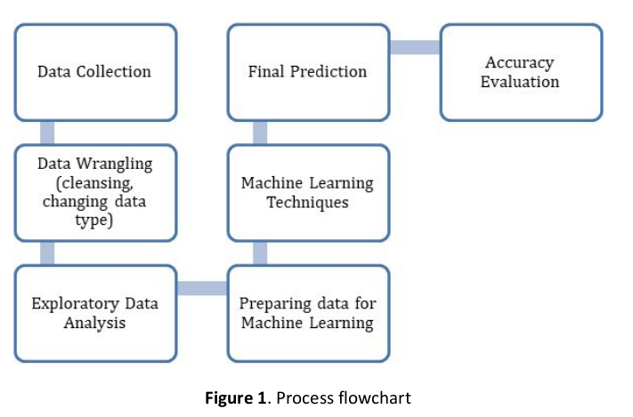

### Preliminary EDA

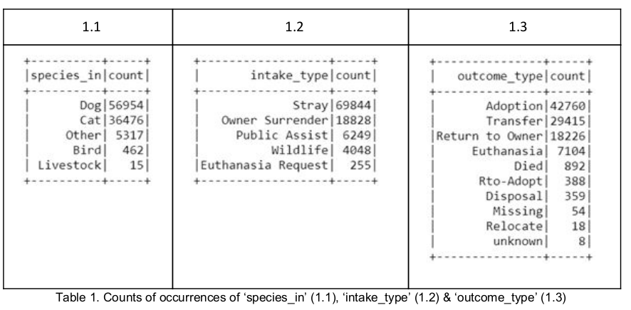


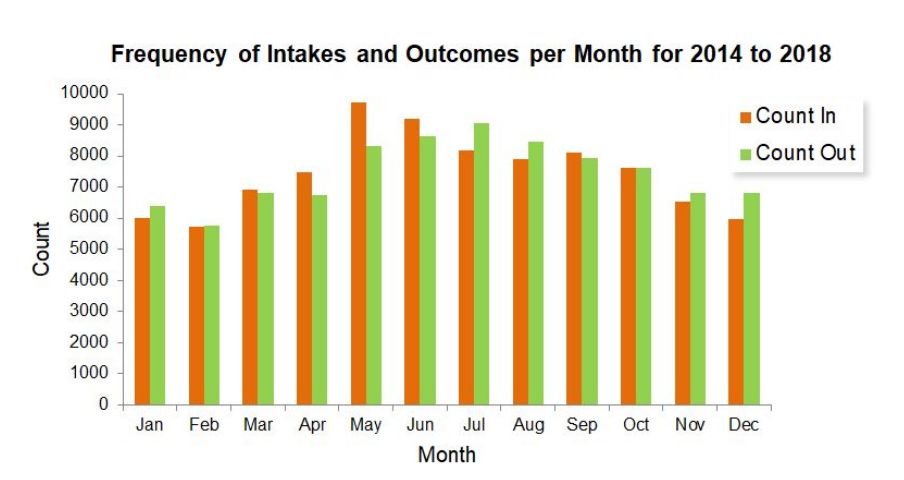

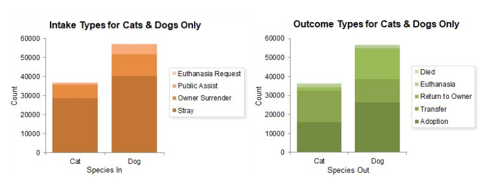


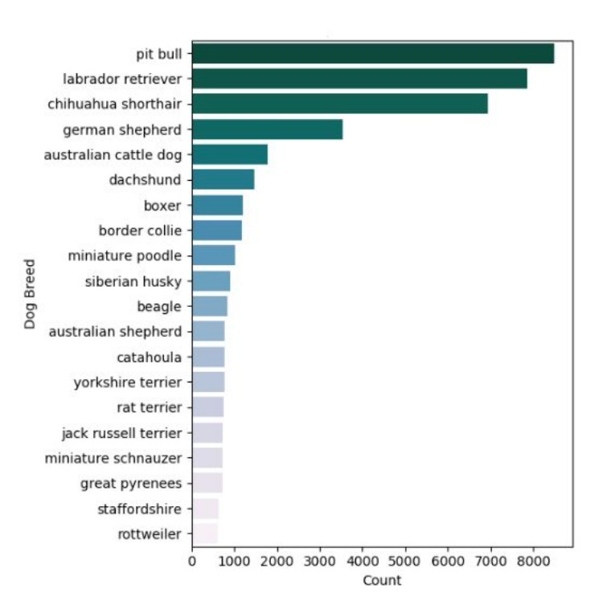

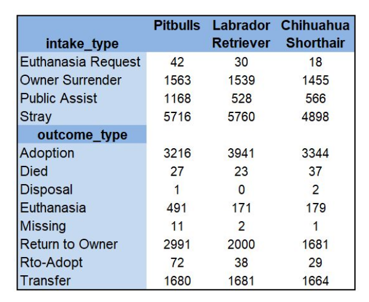

## Feature wrangling, engineering and selection

##### Import and define schema


```scala
def import_data_set_schema(intake: String, outcome: String): (DataFrame, DataFrame) = {

    var in_df = spark.read.option("header","true").csv(intake)
    var out_df = spark.read.option("header","true").csv(outcome)
    val inCols = Seq("animal_id","name_in","datetime_in","monthYear_in","location_found","intake_type", "intake_condition","species_in","sex_in","age_in","breed_in","color_in")
    val outCols = Seq("animal_id","name_out","datetime_out","monthYear_out","dob","outcome_type","outcome_subtype","species_out","sex_out","age_out","breed_out","color_out")
    in_df = in_df.toDF(inCols: _*)
    out_df = out_df.toDF(outCols: _*)

    return (in_df, out_df)
    }
```


##### Create Unique ID for each row based on animal_id and datetime


```scala
def create_unique_id(df1: DataFrame, df2: DataFrame): (DataFrame, DataFrame) = {

    df1.createOrReplaceTempView("df1")
    df2.createOrReplaceTempView("df2")

    val df1_unique = spark.sql(
    """SELECT CONCAT(animal_id, '_', CAST(rownum AS STRING)) AS animal_id_unique
            ,name_in
            ,datetime_in
            ,location_found
            ,intake_type
            ,intake_condition
            ,species_in
            ,sex_in
            ,age_in
            ,breed_in
            ,color_in
    FROM (
        SELECT `animal_id`
            ,`name_in`
            ,`datetime_in`
            ,`location_found`
            ,`intake_type`
            ,`intake_condition`
            ,`species_in`
            ,`sex_in`
            ,`age_in`
            ,`breed_in`
            ,`color_in`
            ,ROW_NUMBER() OVER (PARTITION BY `animal_id` ORDER BY `datetime_in` DESC) AS rownum
        FROM df1
    )
    """)
    df1_unique.createOrReplaceTempView("df1_unique")

    val df2_unique = spark.sql(
    """SELECT CONCAT(animal_id, '_', CAST(rownum AS STRING)) AS animal_id_unique
            ,datetime_out
            ,name_out
            ,dob
            ,outcome_type
            ,outcome_subtype
            ,species_out
            ,sex_out
            ,age_out
            ,breed_out
            ,color_out
    FROM (
        SELECT `animal_id`
            ,`datetime_out`
            ,`name_out`
            ,`dob`
            ,`outcome_type`
            ,`outcome_subtype`
            ,`species_out`
            ,`sex_out`
            ,`age_out`
            ,`breed_out`
            ,`color_out`
            ,ROW_NUMBER() OVER (PARTITION BY `animal_id` ORDER BY `datetime_out` DESC) AS rownum
        FROM df2 
    )
    """)
    df2_unique.createOrReplaceTempView("df2_unique")
   
    return (df1_unique, df2_unique)
}    
```


##### Convert age column into consistent format (years decimal)


```scala
def convert_age(df: DataFrame, sourceTable: String): DataFrame = {
    // define function
    def convert_age(input:String) : Float = {
        if (input == "NULL") {
            var age = -1.toFloat
            return age
        }
        if (input.split("\\D")(0).size > 0){
            var num = input.split("\\D")(0).toFloat
            if (input.matches(".*months?")){
                num = num / 12
            } else if (input.matches(".*weeks?")) {
                num = (num*7)/365
            } else if (input.matches(".*days?")) {
                num = num/365
            }
            return num
        } else {
            var age = -1.toFloat
            return age
        }

    }

    // Generate udf to apply to DataFrame column
    import org.apache.spark.sql.functions.udf
    val convertAge = udf[Float, String](convert_age)

    // Add new age column
    if (sourceTable == "in"){
        val df_updated = df.withColumn("age_years_in", convertAge(scala.Symbol("age_in")))
        return df_updated
    } else if (sourceTable == "out") {
        val df_updated = df.withColumn("age_years_out", convertAge(scala.Symbol("age_out")))
        return df_updated
    } else {
        return df
    }
    
}
```


##### Convert sex column into two separate columns including sex and a boolean variable for desexed


```scala
def convert_sex(df: DataFrame, sourceTable: String): DataFrame= {
    def extract_sex(input:String) : String = {
        var sex = "Unknown"
        if (input.toLowerCase.matches("(.*[^(\\w)]male)|^male.*")) {
            sex = "male"
        } else if (input.toLowerCase.matches("(.*[^(\\w)]female)|^female.*")) {
            sex = "female"
        }
        return sex
    }

    def extract_desexed(input:String) : String = {
        var desexed = "Unknown"
        if (input.toLowerCase.matches("(.*neutered.*)|(.*spayed.*)")) {
            desexed = "true"
        } else if (input.toLowerCase contains "intact"){
            desexed = "false"
        }
        return desexed
    }

    // Generate udf to apply to DataFrame column
    import org.apache.spark.sql.functions.udf
    val extractSex = udf[String, String](extract_sex)
    val extractDesex = udf[String, String](extract_desexed)

    // Add new sex and desexed columns
    if (sourceTable == "in") {
        var updated_df = df.withColumn("sex_only", extractSex(scala.Symbol("sex_in")))
        updated_df = updated_df.withColumn("desexed_in", extractDesex(scala.Symbol("sex_in")))
        return updated_df
    } else if (sourceTable == "out") {
        var updated_df = df.withColumn("sex_only", extractSex(scala.Symbol("sex_out")))
        updated_df = updated_df.withColumn("desexed_out", extractDesex(scala.Symbol("sex_out")))
        return updated_df
    } else {
        return df


    }
}
```


##### Convert colour column into primary and secondary colour


```scala
def convert_colour(df: DataFrame, sourceTable: String): DataFrame = {

    def extract_prim (input:String) : String = {
        if (input.matches(".*/.*")){
            var pri_colour = input.toLowerCase.split("/")(0).split(" ")(0)
            return pri_colour
        } else {
            var pri_colour = input.toLowerCase.split(" ")(0)
            return pri_colour
        }   
    }

    def extract_sec (input:String) : String = {
        if (input.matches(".*/.*")){
            var sec_colour = input.toLowerCase.split("/")(1).split(" ")(0)
            return sec_colour
        } else if (input.matches(".+ .+")) {
            var sec_colour = input.toLowerCase.split(" ")(1)
            return sec_colour
        }  else {
            var sec_colour = null
            return sec_colour
        } 
    }

    // Generate udf to apply to DataFrame column
    val extractPrim = udf[String, String](extract_prim)
    val extractSec = udf[String, String](extract_sec)
    
    // Add new colour cols

    if (sourceTable == "in") {
        var updated_df = df.withColumn("prim_colour_in", extractPrim(scala.Symbol("color_in")))
        updated_df = updated_df.withColumn("sec_colour_in", extractSec(scala.Symbol("color_in")))
        return updated_df
    } else if (sourceTable == "out") {
        var updated_df = df.withColumn("prim_colour_out", extractPrim(scala.Symbol("color_out")))
        updated_df = updated_df.withColumn("sec_colour_out", extractSec(scala.Symbol("color_out")))
        return updated_df
    } else {
        return df
    }    

}
```


##### Reduce breed column into primary and secondary breed


```scala
def convert_breed(df: DataFrame, sourceType: String): DataFrame = {
    
    def extract_mix (input:String) : Boolean = {
        if (input.toLowerCase.matches(".*mix.*") || input.matches(".*/.*")){
            var mix_bool = true
            return mix_bool
        } else {
            var mix_bool = false
            return mix_bool
        }   
    }
    
    def extract_prim_breed (input:String) : String = {
        if (input.matches(".*/.*")){
            var pri_breed = input.toLowerCase.split("/")(0).replaceAll("mix", "").trim
            return pri_breed
        } else {
            var pri_breed = input.toLowerCase.replaceAll("mix", "").trim
            return pri_breed
        }
    }  
    
    
    // Generate udf to apply to DataFrame column
    val extractMix = udf[Boolean, String](extract_mix)
    val extractPrim = udf[String, String](extract_prim_breed)
    
    if (sourceType == "in") {
        var updated_df = df.withColumn("mix_bool", extractMix(scala.Symbol("breed_in")))
        updated_df = updated_df.withColumn("prim_breed_in", extractPrim(scala.Symbol("breed_in")))
        return updated_df
    } else if (sourceType == "out") {
        var updated_df = df.withColumn("mix_bool_out", extractMix(scala.Symbol("breed_out")))
        updated_df = df.withColumn("prim_breed_out", extractPrim(scala.Symbol("breed_out")))
        return updated_df
    } else {
        return df
    } 
    
}
```


##### Datetime column wrangling into consistent format and generation of new date related columns


```scala
def Date_Time_Wrangler (tgtDF: DataFrame,colName: String,sourceType: String): DataFrame={

//Section 1: Variable definition
        val DBColName      = "Date of Birth"
        var dateColName    = ""
        var timeColName    = ""
        var monthColName   = ""
        var MorAftColName  = ""
        lazy val DBweekDate = "BirthWeekDate_out"
        var WeekColName    = ""

//Section 2: UDF function declar
        //Unify Full Format UDF variable definition
        //Function check length of string to definded which format current it is. 
        //***Potential bug or exception could occur when input data formate change
        var unifyTimeString = udf {
            (dt: String) =>{
                val  s24 = new SimpleDateFormat("M/d/yy HH:mm")
                val  d12 = new SimpleDateFormat("M/d/yy hh:mm:ss a")
                val  l24 = new SimpleDateFormat("MM/dd/yyyy HH:mm:ss")
                val  uniFormat = new SimpleDateFormat("MM/dd/yyyy hh:mm:ss a")
                //Remove DateTime string extra space
                var cleanStr = dt.trim().replaceAll(" +", " ")
                
                if (cleanStr.size >= 18){
                   uniFormat.format(l24.parse(cleanStr))
                }else{
                    uniFormat.format(s24.parse(cleanStr))
                }
            }
        }
        //UDF of unify Date format
        //Function check length of string to definded which format current it is. 
        //***Potential bug or exception could occur
        val unifyDateFormat = udf{
            (dt: String) =>{
                val lformat = new SimpleDateFormat("MM/dd/yyyy");
                val sformat = new SimpleDateFormat("M/d/yy");
                if (dt.size == 10) {dt}
                else {lformat.format(sformat.parse(dt))}
            }
        }
    
        //UDF of generate 3 charactors week date string
        var getWeekDate = udf{
            (dt: String) =>{
            val shortWeek = new SimpleDateFormat("E")
            val lformat = new SimpleDateFormat("MM/dd/yyyy")
            shortWeek.format(lformat.parse(dt))
            }
        }
 
        //UDF of generate 3 charactors week date string
        var getMonth = udf{
            (dt: String) =>{
            val Month = new SimpleDateFormat("MMM")
            val lformat = new SimpleDateFormat("MM/dd/yyyy")
            Month.format(lformat.parse(dt))
            }
        }
    
//Section 3: proceed DateTime data proceessing        
    
        colName match{
            //If passed Date of Birth column
            case DBColName => {
                //unify Date formate
                var format_df = tgtDF.withColumn(colName, unifyDateFormat(col(colName)))
                //Generate 3 characters week date column.
                var addWeek_df = format_df.withColumn(DBweekDate, getWeekDate(col(colName)))
                return addWeek_df
            }
            //Processing other Date and Time Column
            //It's consider Other datetime column that has both date and time
            case _ => {
                //Initial column name based on passed in source type
                sourceType.toLowerCase match{
                    //Initialized columns' name for in data source
                    case "in" =>{
                        WeekColName   = "weekday_in"
                        dateColName   = "date_in"
                        timeColName   = "time_in"
                        monthColName  = "month_in"
                        MorAftColName = "ampm_in"
                    }
                    //Initialized columns' name for out data source
                    case "out"=>{
                        WeekColName   = "weekday_out"
                        dateColName   = "date_out"
                        timeColName   = "time_out"
                        monthColName  = "month_out"
                        MorAftColName = "ampm_out"
                    }
                    //Other string will return origional Data Frame
                    case _ => {
                        println("Error in DateTimeWrangle: Please provid data source type as \"In\" or \"Out\"")
                        return tgtDF
                    } 
                }
                //Unified Date Time format
                var trim_df = tgtDF.withColumn(colName, unifyTimeString(col(colName)))
                //Generate Date column
                trim_df = trim_df.withColumn(dateColName, split(col(colName), "\\s")
                                 .getItem(0))
                //Generate Time column and drop the target column
                trim_df = trim_df.withColumn(timeColName, split(col(colName), "\\s")
                                 .getItem(1))
                //Generate AM or PM column
                trim_df = trim_df.withColumn(MorAftColName, split(col(colName),"\\s")
                                 .getItem(2)).drop(colName)
                //Gerate 3 Characters Month Column
                trim_df = trim_df.withColumn(monthColName, getMonth(col(dateColName)))
                //Generate 3 characters week date column.
                trim_df = trim_df.withColumn(WeekColName, getWeekDate(col(dateColName)))
                return trim_df
            }
        }
}
```


```scala
def convert_nulls(df: DataFrame): DataFrame = {
    val updated_df = df.na.fill("unknown", Seq("name_in"))
                .na.fill("unknown", Seq("location_found"))
                .na.fill("unknown", Seq("intake_type"))                                                                                   
                .na.fill("unknown", Seq("intake_condition"))
    // .......
    return updated_df
}
```


```scala
// Encoding categorical features to numeric values stored in vectors

def encode_features(df: DataFrame): DataFrame = {
    // Ensure only categorical columns are encoded
    val feats = df.columns.filterNot(_.toLowerCase().contains("name")).filterNot(_.toLowerCase().contains("date")).filterNot(_.toLowerCase().contains("time")).filterNot(_.toLowerCase().contains("dob")).filterNot(_.toLowerCase().contains("age")).filterNot(_.toLowerCase().contains("id"))
    // Define new encoded columns both indice and vectors
    val encoded_feats = feats.flatMap{ name =>
        val indexer = new StringIndexer()
                        .setInputCol(name)
                        .setOutputCol(name+"_index")
        val encoder = new OneHotEncoderEstimator()
                        .setInputCols(Array(name+"_index"))
                        .setOutputCols(Array(name+"_vector"))
                        .setDropLast(false)
        Array(indexer, encoder)
    }
    val pipeline = new Pipeline().setStages(encoded_feats)  // Setting the encoding pipeline     
    val df_transformed = pipeline.fit(df).transform(df) // Fitting the encoding pipeline to the dataframe
    val non_index_cols = df_transformed.columns.filterNot(_.contains("_index")).toList // List of column names that do not hold index
    val vector_cols = df_transformed.columns.filter(_.contains("_vector")).toSeq // Sequence of column names that hold vectors
    var df_result = df_transformed.select(non_index_cols.head, non_index_cols.tail:_*) // Dataframe with all non-index columns
    vector_cols.foreach(x => df_result = df_result.withColumn(s"$x", to_json(struct(s"$x"))))  // Convert columns that hold vectors to hold json of the vectors
    return df_result
}
```


## PIPELINE

```scala
// Change these to your local path
val intake_file_path = "Austin_Animal_Center_Intakes.csv"
val outcomes_file_path = "Austin_Animal_Center_Outcomes.csv"

// Update import and dataframes
var (in_df, out_df) = import_data_set_schema(intake_file_path, outcomes_file_path)
var (in, out) = create_unique_id(in_df, out_df)
in = convert_breed(convert_colour(convert_sex(convert_age(in, "in"), "in"), "in"),"in")
out = convert_breed(convert_colour(convert_sex(convert_age(out, "out"), "out"), "out"), "out")
in = Date_Time_Wrangler(in, "datetime_in", "in")
out = Date_Time_Wrangler(out, "datetime_out", "out")
out = Date_Time_Wrangler(out, "dob", "out")

// Drop unnecessary columns
var in_dropped = in.drop("sex_in").drop("breed_in").drop("color_in").drop("age_in")
var out_dropped = out.drop("sex_out").drop("sex_only").drop("color_out").drop("breed_out").drop("age_out").drop("ampm_out").drop("month_out").drop("weekday_out").drop("species_out").drop("name_out").drop("time_out").drop("date_out")

// Join dataframes
in_dropped = in_dropped.withColumnRenamed("animal_id_unique", "id_in")
out_dropped = out_dropped.withColumnRenamed("animal_id_unique", "id_out")
val joined = in_dropped.join(out_dropped).where($"id_in" === $"id_out").drop("id_out")

//remove nulls
val nulls_removed = convert_nulls(joined)

//print schema
println("joined schema")
joined.printSchema
```

    joined schema
    root
     |-- id_in: string (nullable = true)
     |-- name_in: string (nullable = true)
     |-- location_found: string (nullable = true)
     |-- intake_type: string (nullable = true)
     |-- intake_condition: string (nullable = true)
     |-- species_in: string (nullable = true)
     |-- age_years_in: float (nullable = false)
     |-- sex_only: string (nullable = true)
     |-- desexed_in: string (nullable = true)
     |-- prim_colour_in: string (nullable = true)
     |-- sec_colour_in: string (nullable = true)
     |-- mix_bool: boolean (nullable = false)
     |-- prim_breed_in: string (nullable = true)
     |-- date_in: string (nullable = true)
     |-- time_in: string (nullable = true)
     |-- ampm_in: string (nullable = true)
     |-- month_in: string (nullable = true)
     |-- weekday_in: string (nullable = true)
     |-- outcome_type: string (nullable = true)
     |-- outcome_subtype: string (nullable = true)
     |-- age_years_out: float (nullable = false)
     |-- desexed_out: string (nullable = true)
     |-- prim_colour_out: string (nullable = true)
     |-- sec_colour_out: string (nullable = true)
     |-- prim_breed_out: string (nullable = true)


```scala
println("Unique breed_in before wrangle: " + in.select("breed_in").distinct.count())
println("Unique color_in before wrangle: " + in.select("color_in").distinct.count())
println("-------------------------------")
println("Unique prim_breed AFTER: " + joined.select("prim_breed_in").distinct.count())
println("Unique prim_colour AFTER: " + joined.select("prim_colour_in").distinct.count())
println("Unique sec_colour AFTER: " + joined.select("sec_colour_in").distinct.count())
```

    Unique breed_in before wrangle: 2397
    Unique color_in before wrangle: 569
    -------------------------------
    Unique prim_breed AFTER: 356
    Unique prim_colour AFTER: 30
    Unique sec_colour AFTER: 35


```scala
joined.groupBy("mix_bool").count().show()
```

    +--------+-----+
    |mix_bool|count|
    +--------+-----+
    |    true|92421|
    |   false| 6803|
    +--------+-----+


```scala
// Encode features
//val result = encode_features(nulls_removed)
```

```scala
// write encoded to csv
nulls_removed.write.csv("phase2_output")
```


## Exploratory Data Analysis

#### Read in data

```scala
//read data from Phase 2 wrangling task.
//name the columns required for EDA
var dataFPN = "phase2_output"
val phase2 = spark.read.format("csv").load(dataFPN)

val colnames = Array("id_in","name_in","location_found_in","intake_type","intake_condition","species_in","age_years_in",
                     "sex_in","desexed_in","prim_colour_in","sec_colour_in","mix_breed_bool_in","prim_breed_in","date_in",
                     "time_in","ampm_in","month_in","weekday_in","dob_in","outcome_type","outcome_subtype","age_years_out",
                     "desexed_out","date_out","time_out","ampm_out","month_out","weekday_out")

val animal_df = phase2.toDF(colnames: _*)

```

#### Animal species count

```scala
val antype = animal_df.
  groupBy('species_in).
  agg(count('id_in) as "count").
  orderBy(desc("count"))
antype.show()
```

```
2019-06-09 05:33:30,395 WARN  [Thread-4] util.Utils (Logging.scala:logWarning(66)) - Truncated the string representation of a plan since it was too large. This behavior can be adjusted by setting 'spark.debug.maxToStringFields' in SparkEnv.conf.
+----------+-----+
|species_in|count|
+----------+-----+
|       Dog|56954|
|       Cat|36476|
|     Other| 5317|
|      Bird|  462|
| Livestock|   15|
+----------+-----+
```

#### Intake type count

```scala
val intake = animal_df.
  groupBy('intake_type).
  agg(count('id_in) as "count").
  orderBy(desc("count"))
intake.show()
```

```
+------------------+-----+
|       intake_type|count|
+------------------+-----+
|             Stray|69844|
|   Owner Surrender|18828|
|     Public Assist| 6249|
|          Wildlife| 4048|
|Euthanasia Request|  255|
+------------------+-----+
```

#### Animal outcomes count

```scala
val outcome = animal_df.
  groupBy('outcome_type).
  agg(count('id_in) as "count").
  orderBy(desc("count"))
outcome.show()
```

```
+---------------+-----+
|   outcome_type|count|
+---------------+-----+
|       Adoption|42760|
|       Transfer|29415|
|Return to Owner|18226|
|     Euthanasia| 7104|
|           Died|  892|
|      Rto-Adopt|  388|
|       Disposal|  359|
|        Missing|   54|
|       Relocate|   18|
|        unknown|    8|
+---------------+-----+
```


```scala
%%python
# import libraries required for plotting
from matplotlib import pyplot as plt
from IPython.display import Image
import tempfile
import seaborn as sns
```

```scala
%%python

df_samp = eda_df_2014to2018.sample(n=1000)
month_order = ("Jan","Feb","Mar","Apr","May","Jun","Jul","Aug","Sep","Oct","Nov","Dec")

plt.clf()
plt.hist([eda_df_2014to2018['month_in'], eda_df_2014to2018['month_out']], color=['red', 'green'])
plt.xticks(month_order)
plt.title("Frequency of Intakes per Month")
plt.legend(["Month In", "Month Out"])
plt.show()
with tempfile.NamedTemporaryFile(suffix=".png") as fo:
    plt.savefig(fo.name)
    retval = Image(filename=fo.name)
```


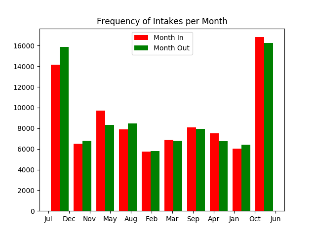


## Correlations

Getting a measure of the correllations between variables will help to choose the most effective variables for the machine learning phase.<br>
First, define some functions to assist with this:

```scala
// 

def getColNames (dfSchema: Array[String],pattern: scala.util.matching.Regex): Array[String]={
    var colList = new Array[String](0)
    dfSchema.foreach({ 
        colName :String =>{
            colName match{
                
                case pattern() => colList = colList :+ colName
                case _ => 
            }
    }})
    return colList
} 
```

```scala
def vectorize (df: DataFrame,colName: String):DataFrame={
    val encoder = new OneHotEncoderEstimator()
                            .setInputCols(Array(colName))
                            .setOutputCols(Array(colName+"_vector"))
                            .setDropLast(false)
    val in_vec  = encoder.fit(df).transform(df)
    return in_vec
}
```

```scala
def indexing (df: DataFrame,colName: String):DataFrame={
    val indexer = new StringIndexer().setInputCol(colName).setOutputCol(s"indexed_$colName")
    val in_idx  = indexer.fit(df).transform(df)
    return in_idx.drop(colName)
}
```

```scala
def encodingData(df: DataFrame, encodeType: String, skipCols: Array[String]): DataFrame ={
    var trans = df
    encodeType.toLowerCase match {
        case "index" => {
            df.schema.names.foreach({
                colName => {
                    if(!skipCols.contains(colName)){
                        trans = indexing(trans,colName)
                    }
                    trans = trans.drop(colName)
                }
            })
            return trans
        }
            
        case "vector"=>{
            df.schema.names.foreach({
                colName => {
                    if(!skipCols.contains(colName)){
                        trans = vectorize(trans,colName)
                    }
                    trans = trans.drop(colName)
                }
            })
            return trans
        }
        case _ => {
            println("Error in encodingData: 2nd Parameter is not a supported encoding method")
            return df
        }
    }
}
```

```scala
def corrCal (index_in : DataFrame, index_out: DataFrame):DataFrame={
//    val outColNameRegx = "indexed_.*".r
//    val inColNameRegx  = "indexed_.*".r
    var outCols = index_out.schema.names
    var inCols  = index_in.schema.names
    val in_skip_cols = Array("indexed_id_in_vector","indexed_id_in")

    val crType = "pearson"

    
    var df = sc.parallelize(inCols).toDF("In_Schema")
    df.show()
    outCols.foreach(outColName => {
        var outcol :RDD[Double]= index_out.select(outColName).rdd.map(r=>r.getAs[Double](0))
        var arrElement = new Array[(String, Double)](0)
        inCols.foreach(inColName => {
            if (!in_skip_cols.contains(inColName)){
                // var chi = ChiSquareTest.test(df, inColName, outColName).head
                try{
                    var incol:RDD[Double]= index_in.select(inColName).rdd.map(r=>r.getAs[Double](0))
                    var corr:Double = Statistics.corr(incol,outcol,crType)
                    corr = BigDecimal(corr*100).setScale(4, BigDecimal.RoundingMode.HALF_UP).toDouble
                    print(s"Correlation of $inColName VS $outColName: $corr\n")
                    arrElement = arrElement :+ (inColName, corr)
                }catch{
                    case e:Throwable =>{
                        println(s"\nException occur: ${e.printStackTrace()}")
                        arrElement = arrElement :+ (inColName, 0.0)
                    }
                }
            }
        })
        df = df.join(sc.parallelize(arrElement).toDF("In_Schema",outColName),Seq("In_Schema"),"inner")
        df.count()
    })
    return df

}
```

```scala
val non_categ_col_name = Array("name_in","name_out","date_in","date_out"
                              ,"time_in","time_out","dob_out","age_in","age_out"
                              ,"id_in","id_out")
val in_cols_regx = ".*_in$".r
val out_cols_regx = ".*_out$".r
val encode_index = "index"
val encode_vector= "vector"

val in_cols_list = getColNames(colnames,in_cols_regx)
var out_cols_list = getColNames(colnames,out_cols_regx)

var in_df = animal_df.select(in_cols_list.map(c => col(c)): _*)
var out_df = animal_df.select(out_cols_list.map(c => col(c)): _*)

var index_in = encodingData(in_df,encode_index,non_categ_col_name)
var index_out= encodingData(out_df,encode_index,non_categ_col_name)
var vec_data = encodingData(index_in,encode_vector,non_categ_col_name )

```

```scala
%%time
var AACcorr = corrCal(index_in,index_out)
AACcorr.count()
AACcorr.show()
```


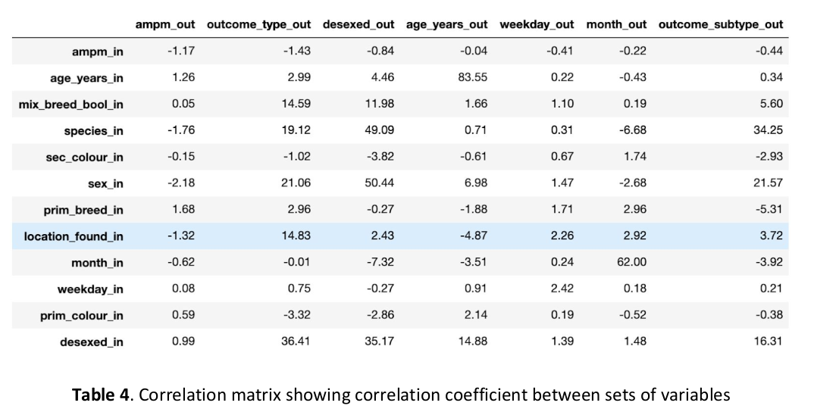

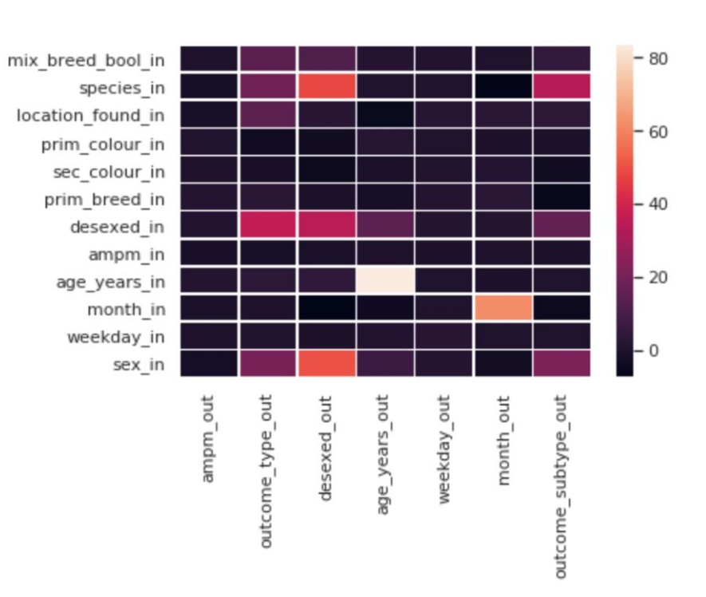


```scala
%%python
from matplotlib import pyplot as plt
from IPython.display import Image
import tempfile

df_samp = eda_df.sample(n=1000)

plt.clf()
plt.bar(df_samp['species_in'],df_samp['age_years_in'])
plt.show()
with tempfile.NamedTemporaryFile(suffix=".png") as fo:
    plt.savefig(fo.name)
    retval = Image(filename=fo.name)
```


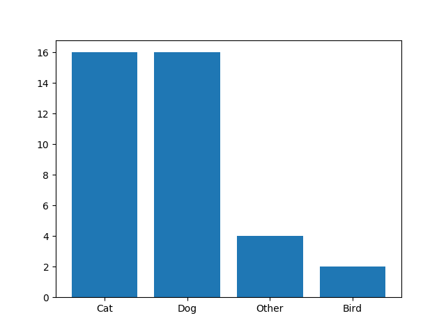

```scala
%%python
from matplotlib import pyplot as plt
from IPython.display import Image
import tempfile
import seaborn as sns

df_samp = eda_df.sample(n=1000)

plt.clf()
sns.boxplot(x='intake_condition', y='age_years_in', data=df_samp, orient='v')
plt.title("Condition of Intake Animals by Age")
plt.show()
with tempfile.NamedTemporaryFile(suffix=".png") as fo:
    plt.savefig(fo.name)
    retval = Image(filename=fo.name)
```


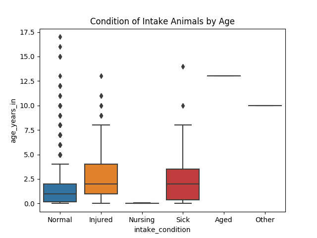


```scala
%%python

df_samp = eda_df.sample(n=1000)

plt.clf()
sns.boxplot(x='species_in', y='age_years_out', data=df_samp, orient='v')
plt.title("Average Age Out")
plt.show()
with tempfile.NamedTemporaryFile(suffix=".png") as fo:
    plt.savefig(fo.name)
    retval = Image(filename=fo.name)
```


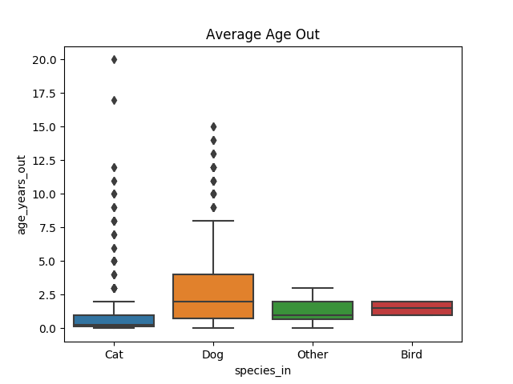


## Machine Learning

#### Encode and import data functions

```scala
// Encoding features for machine learning models

def encode_features_ml(df: DataFrame, target_feat: String, assembled_feat: String): (DataFrame, Array[StringIndexer], StringIndexerModel, VectorAssembler) = {
    // Ensure only categorical columns are encoded
    //val feats = df.columns.filterNot(_.toLowerCase().contains(target_feat)).filterNot(_.toLowerCase().contains("name")).filterNot(_.toLowerCase().contains("date")).filterNot(_.toLowerCase().contains("time")).filterNot(_.toLowerCase().contains("dob")).filterNot(_.toLowerCase().contains("age")).filterNot(_.toLowerCase().contains("id"))
    val feats = df.columns.filterNot(_.toLowerCase().contains("name")).filterNot(_.toLowerCase().contains("date")).filterNot(_.toLowerCase().contains("time")).filterNot(_.toLowerCase().contains("dob")).filterNot(_.toLowerCase().contains("age")).filterNot(_.toLowerCase().contains("id"))
    // Define new encoded columns both indice and vectors
    val indexers = feats.map(name => new StringIndexer()
            .setInputCol(name)
            .setHandleInvalid("keep")
            .setOutputCol(name + "_index")            
    )
    val target_indexer = new StringIndexer()
            .setInputCol(target_feat)
            .setHandleInvalid("keep")
            .setOutputCol(target_feat + "_index")  
    val target_model = target_indexer.fit(df)
    val index_feats = feats.map(_+"_index")
    val feature_assembler = new VectorAssembler() 
            .setInputCols(index_feats)
            .setHandleInvalid("keep")
            .setOutputCol(assembled_feat)
    val pipeline = new Pipeline().setStages(indexers)  // Setting the indexer in the pipeline        
    val df_transformed = pipeline.fit(df).transform(df) // Fitting the encoding pipeline to the dataframe
    val df_return = feature_assembler.transform(df_transformed) // Assembling features into one combined feature
    return (df_return, indexers, target_model, feature_assembler)
}

//read data from Phase 2 wrangling task.
def read_phase2_csv(filename: String): DataFrame = {
    val phase2 = spark.read.format("csv").option("header", "true").load(filename)
   
    val df = phase2.toDF()
    return df
}
```

### Decision Tree (Random Forest)

```scala
// TRAIN DECISION TREE
def train_decision_tree_model(train_data: DataFrame, target_feat: String, assembled_feat: String): RandomForestClassificationModel  = {
    // Define the Random Forest model estimator
    val rf = new RandomForestClassifier()
      .setLabelCol(target_feat + "_index")
      .setFeaturesCol(assembled_feat)
      .setNumTrees(4) 
      .setMaxDepth(3) 
      .setMaxBins(1000)
    
    // Train model with training dataset
    val model = rf.fit(train_data)
    
    return model
} 

// TEST DECISION TREE
def test_decision_tree_model(test_data: DataFrame, model: RandomForestClassificationModel, target_model: StringIndexerModel): DataFrame = {
    // Test model with testing dataset
    var test_pred = model.transform(test_data)
    
    // Decode prediction transformer
    val decoder = new IndexToString()
        .setInputCol("prediction")
        .setOutputCol("prediction_decoded")  
        .setLabels(target_model.labels)
    
    // Generate decoded prediction dataframe
    val test_pred_decoded = decoder.transform(test_pred)
    
    return test_pred_decoded
}
```


### Naive Bayes Algorithm

```scala
// TRAIN NAIVE BAYES
def train_naive_bayes_model(train_data: DataFrame, target_feat: String, assembled_feat: String): NaiveBayesModel  = {
    // Define Naive Bayes Classifier
    val nb = new NaiveBayes()
        .setLabelCol(target_feat + "_index")
        .setFeaturesCol(assembled_feat)
    
    // Train model with training dataset
    val model = nb.fit(train_data)
    
    return model
} 

// TEST NAIVE BAYES
def test_naive_bayes_model(test_data: DataFrame, model: NaiveBayesModel, target_model: StringIndexerModel): DataFrame = {
    // Test model with testing dataset
    var test_pred = model.transform(test_data)
    
    // Decode prediction transformer
    val decoder = new IndexToString()
        .setInputCol("prediction")
        .setOutputCol("prediction_decoded")  
        .setLabels(target_model.labels)
    
    // Generate decoded prediction dataframe
    val test_pred_decoded = decoder.transform(test_pred)
    
    return test_pred_decoded
}
```


### Logistic Regression Classification Algorithm

#### Train model

```scala
def train_lr_model(train_data: DataFrame, target_feat: String, assembled_feat: String): LogisticRegressionModel  = {
    // Define Logistic Regressor Classifier
    val lr = new LogisticRegression()
        .setLabelCol(target_feat + "_index")
        .setFeaturesCol(assembled_feat)
        .setMaxIter(10)
        .setRegParam(0.3)
        .setElasticNetParam(0.8)
    
    // Train model with training dataset
    val model = lr.fit(train_data)
    
    return model
} 
```


#### Test model

```scala
def test_lr_model(test_data: DataFrame, model: LogisticRegressionModel, target_model: StringIndexerModel): DataFrame = {
    // Test model with testing dataset
    var test_pred = model.transform(test_data)
    
    // Decode prediction transformer
    val decoder = new IndexToString()
        .setInputCol("prediction")
        .setOutputCol("prediction_decoded")  
        .setLabels(target_model.labels)
    
    // Generate decoded prediction dataframe
    val test_pred_decoded = decoder.transform(test_pred)
    
    return test_pred_decoded
}
```


### Evaluate model Function

```scala
def evaluate_prediction(algorithm_name: String, df: DataFrame, target_feat: String, prediction_col: String) = {
    // Evaluate test data's accuracy
    var evaluator = new MulticlassClassificationEvaluator()
      .setLabelCol(target_feat + "_index")
      .setPredictionCol(prediction_col)
      .setMetricName("accuracy") 
    val accuracy = evaluator.evaluate(df)
    println(s"$algorithm_name - Test dataset: Accuracy=$accuracy")
    
    // Evaluate test data's f1
    evaluator = new MulticlassClassificationEvaluator()
      .setLabelCol(target_feat + "_index")
      .setPredictionCol(prediction_col)
      .setMetricName("f1")
    val f1 = evaluator.evaluate(df)
    println(s"$algorithm_name - Test dataset: F1=$f1")
}
```


```scala
// Read Phase2 csv
val phase2_df = read_phase2_csv("encoded_output")

// Select features
val selected_join = phase2_df.select(
              "id_in",
              "intake_type",
              "intake_condition",
              "species_in",
              "age_years_in",
              "sex_in",
              "desexed_out",
              "prim_colour_in",
              "prim_breed_in",
              "outcome_type",
              "town_found"
)  

// Set target feature
val target_feat = "outcome_type"
val assembled_feat = "assembled_features"

// Encode and index features
val (result, indexers, target_model, assembler) = encode_features_ml(selected_join, target_feat, assembled_feat)

// Create train and test dataset
val Array(train_data, test_data) = result.randomSplit(Array(0.80, 0.20))

// Decision Tree (Random Forest) Algorithm
val decision_tree_model = train_decision_tree_model(train_data, target_feat, assembled_feat)
// Test model
val decision_tree_prediction = test_decision_tree_model(test_data, decision_tree_model, target_model)
// Evaluate model
evaluate_prediction("Decision Tree", decision_tree_prediction, target_feat, "prediction") 

// Use Naive Bayes Algorithm
val naive_bayes_model = train_naive_bayes_model(train_data, target_feat, assembled_feat)
// Test model
val naive_bayes_prediction = test_naive_bayes_model(test_data, naive_bayes_model, target_model)
// Evaluate model
evaluate_prediction("Naive Bayes", naive_bayes_prediction, target_feat, "prediction")

// Use Logistic Regression Algorithm
val lr_model = train_lr_model(train_data, target_feat, assembled_feat)
// Test model
val lr_prediction = test_lr_model(test_data, lr_model, target_model)
// Evaluate model
evaluate_prediction("Logistic Regression", lr_prediction, target_feat, "prediction")
```


## Algorithm Results

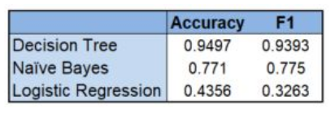

